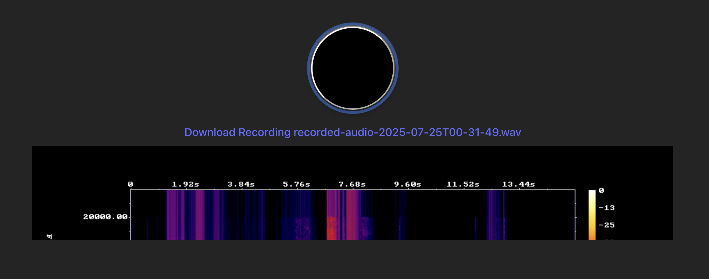

# 🎙️ Browser Audio Recorder with FFmpeg & Spectrogram

This prototype demonstrates an in-browser audio recorder that:

- Streams microphone input using the MediaRecorder API
- Converts the final WebM audio to WAV format using `@ffmpeg/ffmpeg` (WebAssembly)
- Generates a spectrogram image from the recording using FFmpeg's `showspectrumpic` filter
- Displays downloadable WAV audio and spectrogram outputs

Built with **React**, **Vite**, **TypeScript**, and **FFmpeg WASM**.

> 🚀 [Live Demo](https://audio-capture-demo.vercel.app/) — *(hosted version)*

## 📸 Preview



| Recording | Output |
|-----------|--------|
| 🎤 Live audio recording with preview button | 🎧 WAV audio file + 📊 Spectrogram PNG |

## 🧠 Why This Exists

This was built as a prototype to explore:
- How to run FFmpeg in the browser
- Converting and analyzing audio files entirely on the client
- Working with real-time audio data in chunks
- A future goal of streaming live audio into a transcription engine like Whisper

## 🧪 Running Locally

```bash
git clone https://github.com/jasonsof/audio-capture-demo.git
cd audio-capture-demo
npm install
npm run dev
```
